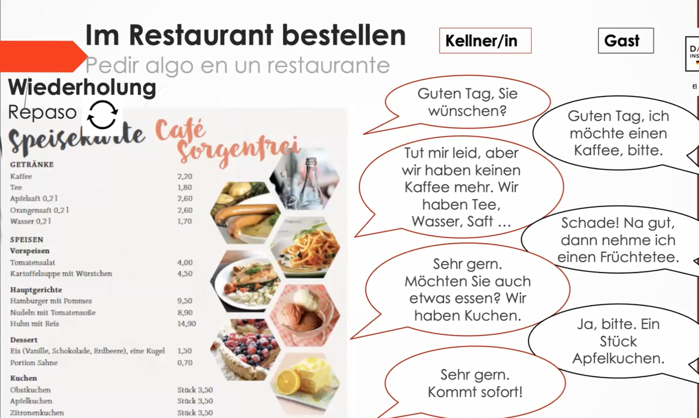
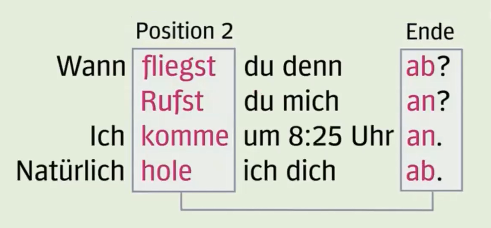
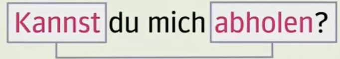

# Codigos Umlaut
ß	Alt + 0223  
ä	Alt + 0228  
Ä	Alt + 0196  
ö	Alt + 0246  
Ö	Alt + 0214  
ü	Alt + 0252  
Ü	Alt + 0220  

# Vokabular

*Verbos*

 1. möchten - Gustar, desear
 2. nehmen - tomar (por ejemplo, en el restaurante) / Literalmente tomar
 3. Flughafen - Aeropuerto
 4. Flugzeug - Avión
 5. Flugreise - Viaje en avion
 6. der Bahnhof - Estacion de tren
 7. die U-Bahn - Tren subterraneo (subway)
 8. das Taxi - Taxi
 9. der Bus - Autobús
 10. der Zug - Tren
 11. die Straßebahn - Tranvia
 12. die S-bahn - Schell ban - Tre de trauyectos cortosa
 13. der Kodder - maletas
 14. die Tasche - Morral de agarradera (como el deportivo de Gabriel)
 15. das Gepäck - El equipaje (Concepto general)
 16. der Rucksack - El bolso/ Mochila (Concepto general)
 17. wenig - Poco/ poquito
 18. Akku - Batería
 19. Abholen - Retirar/ recoger
 20. 

# Frases de repasito

 1. Guten Tag. Was möchten Sie trinken?
 2. Ich nehme einen Kaffe
 3. nimmst du den Bus auf die Arbeit? - ¿Tomas el bus a la oficina?
 4. Nein, ich nehme immer ein Taxi
 5. Was möchtest du in Deutschland machen? - ¿Qué te gustaría hacer en Alemania?
 6. Ich möchte in Deutschland arbeiten und studieren.
 7. nehmt ihr euren (posesivo de uds) Kaffe mit oder ohne (sin)  Zucker? - ¿Tomas el café con o sin azúcar?
 8. Ich möchte Keinen Zucker im Kaffe, danke

**Ejercicio de practica**
   

# Verbos separables

En aleman existen verbos que se pueden separar. La idea es coger un verbo y agregarle una preposicion al verbo. por ejemplo:

 * Fliegen - Volar: Por si solo este es el verbo volar, sin embargo cuando le agregamos la particula "ab" al inicio del verbo, modificamos su significado.

 * Abfliegen - ab | fliegen - Literalmente seria como "Volar a" pero la idea es que el verbo "fliegen" se modifica para que sea más específico. En este caso significaria "Despegar" puesto que la aprticula ab al inicio indicaria el comienzo de dicha accion. 

 * rufen - llamar: Literalmente llamar a alguien, implicando que fisicamente llamo a alguien que me puede escuchar.

 * anrufen - llamar - ab | rufen: Llamar por telefono a alguien.

 * kommen - venir/llegar

 * ankommen - llegada (en el momento): traduce algo como "momento de llegada" como verbo

 * holen - traer | abholen - traer de alguna aprte (mas especifico)

 * steigen - Escalar/subirse en algo |**einsteigen** - Entrar/abordar  - **aussteigen** - Salir/bajarse | **umsteigen** - Seria como hacer cambio de tren o montaerme de un coche a otro/ transbordo

## Ejemplos verbos divisbles

### Caso especial verbos modales con verbo divisible
