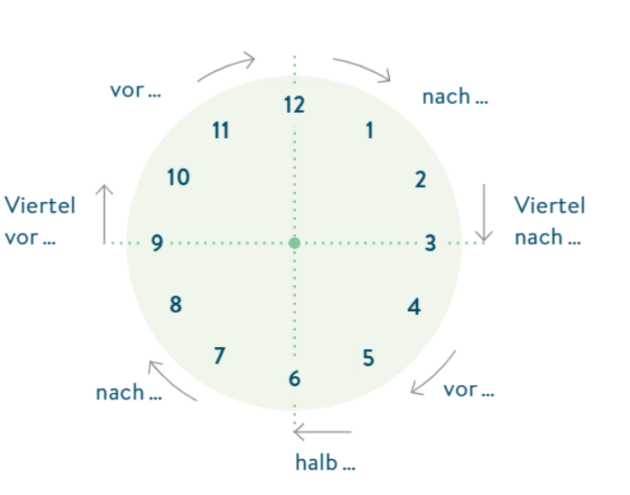

# Codigos Umlaut

ß	Alt + 0223
ä	Alt + 0228
Ä	Alt + 0196
ö	Alt + 0246
Ö	Alt + 0214
ü	Alt + 0252
Ü	Alt + 0220

# Vocabulario

* Reiten - montar caballo

* Kochen - cocinar

* Schach spielen - jugar ajedrez

* Versicherungskaufmann - agente de seguro

* Seniorenheim - Ancianato/asilo 

* lange - largo

## **Verbos irregulares a aprender**

### lesen - leer
 * ich lese
 * du liest
 * er/Sie liest
 * wir lesen
 * ihr lest
 * sie/Sie lesen

### treffen - encontrar
 * ich treffe
 * du triffst
 * er/Sie trifft
 * wir treffen
 * ihr trefft
 * sie/Sie treffen

### fahren - ir/manejar
 * ich fahre
 * du fährst
 * er/Sie fährt
 * wir fahren
 * ihr fahrt
 * sie/Sie fahren
  

# Wer kann

**Repaso de Wer Kann** 

Ich kann nicht so gut Reiten

Meine schwester Lissa kann sehr gut Malen

Ich kann nicht so gut Gitarre spielen

Mein Bruder Tobias kann super Fußball spielen

Meine Enkelin kann super tanzen

Meine Eltern konnen wirklich gut tanzen

Mein Frau kann wiirklich gut kochen

* ich kann ein bisschen Schach spielen

## Adverbios de frecuencia -  Wie oft Schwimmst du? 

Adverbios de frecuencia

 * Immer - siempre
 * oft - frecuentemente
 * manchmal - a veces
 * fast nie - casi nunca
 * nie - nunca
  
Wie oft schimmst du?
Ich Schwimme nie - Nunca nado
Ja, ich schwimme manchmal - A veces nado
Ich schwimme jede Woche - Nado cada semana
ich schwimme jede suntag - Nado cada domingo

## Was machst du in deiner Freizeit?

# Gerhen - ir: Orte für Freizeitaktivitäten / otras actividades de tiempo libre

* das Kino - Cine
* das Museum - Museo
* das Theater - Teatro
* das Café - Cafe
* die Ausstellung - Exposición
* der klub - Club
* die Disco - Disco
* das Schwimmbad - Piscina
* das Konzert - Concerto
* das Restaurant - Restaurante
* die Bar - Bar
* das Fitnesscenter - Centro de fitness/ Gimnasio

## Dias de la semana 

* der Montag - Lunes
* die Dienstag - Martes
* der Mittwoch - Miercoles
* die Donnerstag - Jueves
* der Freitag - Viernes
* die Samstag - Sábado
* die Sonntag - Domingo

Para referirnos a los dias de la semana se usa la preposion "am", por ejemplo::

 * Julia hat **am** Montag keine Zeit - Julia no tiene tiempo el lunes
 * **Am** Montag hat Julia keine Zeit - El lunes Julia no tiene tiempo

## Praktische Übung - Práctica

 * Ich gehe gerne **ins** Kino. Dort (allá) kann man.. (Allá se puede...) Filme schauen
 * Ich gehe gerne  den **(in den)** Klub. Dort kann mann tanzen 
 * Ich gehe gerne in **eine** Bar Bier Trinken
 * Ich gehe am montag zum Deutschkurs - Voy a estudiar el lunes alemán
 * Am Dienstag gehe ich immer ins Fitnessstudio - En los martes siempre voy al Gimnasio
 * Ich studiere oft am Mittwoch, aber ich gehe nie ins Fitnessstudio. - A veces estudio el miércoles, pero no voy al Gimnasio
 * Ich spiele manchmal donnerstags Gitarre,  und ich übe jeden Donnerstag Deutsch.
 * Am Freitag gehe ich immer ins Restaurant essen. - En los viernes voy siempre al restaurante a comer
 * Am Wochenende gehe ich manchmal in den Klub mit meinen Freunden. - En los fines de semana algunas veces voy a ir al club con mis amigos

# Clase 8.2 - Die Uhrzeit - La hora

## ``Vocabulario``

 * der Morgen - mañana
 * der Abend - tarde
 * der Nachmittag - media tarde
 * der Vormittag - antes de la mañana
 * der Mittag - mediodía
 * die Nacht - noche
 * Viertel - "Cuarto"

## Teoria

Se suele usar la hora militar. 

**Ejemplos**

 * 15:00 - funfzehn Uhr **oder** drei Uhr
 * 15:15 - funfzehn Uhr funfzehn **oder** Viertel nach drei
 * 15:30 - funzehn Uhr dreibig **oder** halb vier (media hora para la 4)
 * 15:25 - funfzehn Uhr funfundzwanzig **oder** funf vor halb vier
 * 6:30 - halb sieben

**Preposiciones**

 * um - Pra preguntar a que horas nos vemos? Por ejemplo 

 * Wie viel Uhr ist es? / Wie spät ist es? - Que hora es?  

# Actividad en clase

Para est actividad vamos a crear una oracion para cada dia de la semana. La frase tiene que tener la hora y el dia de la semana junto a una accion especifica. 
1. Am Montag um einundzwanzig Uhr habe ich Deutschkurs mit meinen Freunden.  
    - El lunes a las 21:00 tengo clase de alemán con mis amigos.  
2. Am Dienstag um acht Uhr gehe ich ins Fitnessstudio.  
    - El martes a las 8:00 voy al gimnasio.  
3. Am Mittwoch um zehn Uhr spiele ich manchmal Schach.  
    - El miércoles a las 10:00 a veces juego ajedrez.  
4. Am Donnerstag um sieben Uhr lese ich ein Buch.  
    - El jueves a las 7:00 leo un libro.  
5. Am Freitag um einundzwanzig Uhr gehe ich ins Kino mit meinen Freunden.  
    - El viernes a las 21:00 voy al cine con mis amigos.  
6. Am Sonntag um elf Uhr fahre ich mit dem Fahrrad.  
    - El domingo a las 11:00 monto en bicicleta.  

RETO DE CHAT GPT:
7. Am Donnerstag um acht Uhr gehe ich zur Arbeit.  
    - El jueves a las 8:00 voy al trabajo.  
8. Am Montag um halb vier schlafe ich mit meiner Frau. (⚠️ connotación sexual)  
    - El lunes a las 3:30 duermo con mi esposa. (⚠️ connotación sexual)  
9. Am Dienstag um Viertel vor zehn koche ich mein Mittagessen.  
    - El martes a las 9:45 cocino mi almuerzo.  
10. Am Samstag um dreizehn Uhr gehe ich ins Fitnessstudio.  
     - El sábado a las 13:00 voy al gimnasio.  
11. Am Samstag um dreiundzwanzig Uhr spiele ich manchmal Videospiele.  
     - El sábado a las 23:00 a veces juego videojuegos.  

# Actividad de repaso 2

Practica de esta conversacion con los lugares:

 1) Wann gehen wir ins Kino?
 2) Vielleicht am montag?
 1) Wann denn?
 2) Am Nachmittag?
 1) Am Nachmittag kann ich nicht. Ich arbeite. Kanns du am Abend? 
 2) Ok, Am abend kann ich. Bis Motagabend

**Traduccion**

¿Cuándo vamos al cine?
¿Quizás el lunes?
¿Cuándo entonces?
¿Por la tarde?
Por la tarde no puedo. Trabajo. ¿Puedes tú en la noche?
Ok, en la noche puedo. Hasta el lunes por la noche.

# Actividad de repaso 3:

Wie viel Uhr ist es? - Que hora es?
Wie spät ist es? - Que hora es?

Responda a estas preguntas con la hora correcta.

# Codigos Umlaut

ß	Alt + 0223
ä	Alt + 0228
Ä	Alt + 0196
ö	Alt + 0246
Ö	Alt + 0214
ü	Alt + 0252
Ü	Alt + 0220

# Preposiciones temporales - Temporale Präpositionen - Uhrzeit

Para referirnos  ahoras y dias de la semana se usa la preposion "am".

1. **Wann** ist der Konversationsclub? - Der Konversationsclub ist am Mittwoch.
2. **Wann** trinks du Kafffe? - Ich trinke **am** morgen Kaffe.
3. **Wann** beginnt der Deutschunterricht? - **Um** halb sieben (6:30) beginnt der Deutschunterricht (lo mismo que Deutchskurs).
4. **Um wie viel Uhr** beginnt der Deutschunterricht? - Der Deutschunterricht beginnt **um** halb sieben (6:30).
5. **Wann** ist dein nächster kursTermin (Termin-Cita ; Kurs- Curso; Kurs-Termin- Clase)? 
Rta. Mein nächster Kurstermin ist **am** Donnerstag um neun Uhr. 

## Actividad de repaso - Aktivität

Ergänze Sie am, um oder in(s)

 1. Kommst du ___ Samstag mit ___ Restaurant? () - 

✅ Ver respuesta

**Kommst du _am_ Samstag mit _ins_ Restaurant?**

- ✅ **am** se usa para días de la semana → *am Samstag* (el sábado)
- ✅ **ins** = in + das → *ins Restaurant* (al restaurante); ins se usa para los artículos "das"

 2. Wir treffen Ruth ___ Sonntagnachmittag zum Kaffeetrinken

 

✅ Ver respuesta

**Wir treffen Ruth __am__ Sonntagnachmittag zum Kaffeetrinken**

- ✅ **am** se usa para días de la semana → *am Samstag* (el sábado)
- ✅ **treffen** = in + das → *ins Restaurant* (al restaurante)

 3. Mein Großeltern kommen __ der Nacht aus Mannheim

 

✅ Ver respuesta

**Mein Großeltern kommen __ der Nacht aus MannheimMein Großeltern kommen __ der Nacht aus Mannheim**

- ✅ **am** se usa para días de la semana → *am Samstag* (el sábado)
- ✅ **In** = En la noche vienen (In der Nacht)
- ✅ **der Nacht** = la noche
- ✅ **aus Mannheim** = vienen "de Manheim#

 4. Vielleicht gehe ich ___ 20:30 Uhr ___ Kino.

 

✅ Ver respuesta

**Vielleicht gehe ich __ die Nacht __ Kino.**

- ✅ **um**: Preposicion de hora 
- ✅ **Ins** - In das Kino - Ins Kino
- ✅ **Kino** = el cine
- ✅ **Vielleicht** = quizás/Tal vez

 5. Kommst du ___ heute mit?

 

✅ Ver respuesta

**Kommst du am heute mit?**

- ✅ **am**: Preposicion de hora 
- ✅ **mit**: Preposicion de lugar 
- ✅ **heute**: hoy

 6. __ Abend gehe ich nicht so gern ___ Cafe.

 

✅ Ver respuesta

**am Abend gehe ich nicht so gern ins Cafe.**

- ✅ **Abend**: noche/Media tarde
- ✅ **gehen**: ir
- ✅ **nicht**: no
- ✅ **so**: so
- ✅ **gern**: Gustar
- ✅ **Cafe**: cafe
- ✅ **ins**: In das Caffe- Ins Cafe

 7. Ich glaube, die Kollegen gehen __ Dienstag ___ 17:15 ___ Die Ausstellung

 

✅ Ver respuesta

**Ich glaube, die Kollegen gehen am Dienstag um 17:15 ins Ausstellung.**

- ✅ **am**: Preposicion de hora 
- ✅ **Dienstag**: martes
- ✅ **um**: Preposicion de hora 
- ✅ **17:15**: 17:15
- ✅ **in**: In das Ausstellung - In Ausstellung
- ✅ **Ausstellung**: exposición
- ✅ **Ich glaube**: Creo que
- ✅ **die Kollegen**: los compañeros

