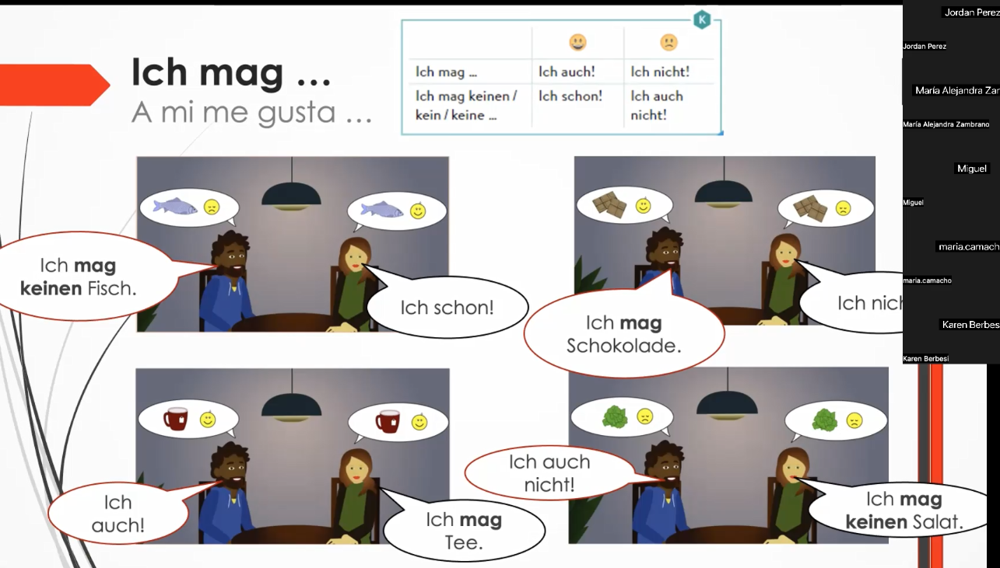
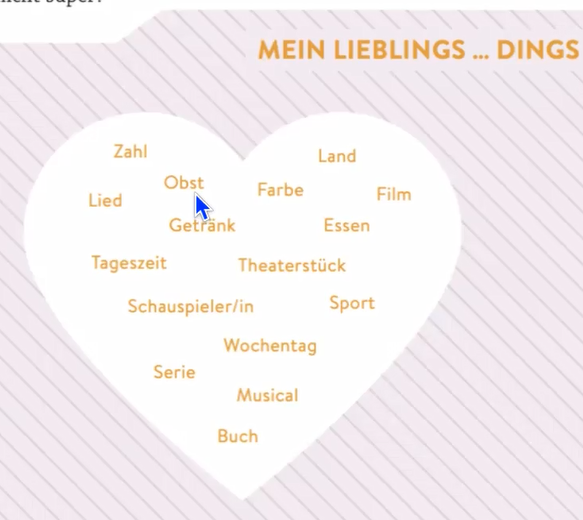

# Codigos Umlaut
ß	Alt + 0223  
ä	Alt + 0228  
Ä	Alt + 0196  
ö	Alt + 0246  
Ö	Alt + 0214  
ü	Alt + 0252  
Ü	Alt + 0220  

# Vokabular

Benutzen Sie die folgende Seite, um Vokabeln zu wiederholen:

https://learningapps.org/display?v=p6zt1eq6a20

# Aktivität 9 – Wiederholung mit Laura

**Vokabular**

1. mögen – gustar, agradar
2. möchten – querer, desear
3. nehmen – tomar (por ejemplo, en el restaurante)
4. Stück – pedazo, trozo
5. Kuchen – pastel, torta
6. Fleisch – carne

Diese Verben sind unregelmäßig. Beispiele für die Aktivität:

# Wir möchten zwei Joghurts und zwei Stück Schokoladenkuchen und ein Stuck Käse

1. Ich **nehme** Pizza und Spaghetti. – Yo tomo pizza y espaguetis.
2. Was **magst** du essen? – ¿Qué te gusta comer?
3. Wir möchten zwei Kaffee und ein Stück Kuchen. – Nosotros queremos dos cafés y un pedazo de pastel.
4. Anna **mag** keinen Fisch, aber sie **möchte** einen Salat. – A Anna no le gusta el pescado, pero quiere una ensalada.
5. **Mögt** ihr gern Schokolade? – ¿Os gusta el chocolate?
6. Ich **nehme** eine Suppe, bitte. – Yo tomo una sopa, por favor.
7. Mein Vater **mag** kein Gemüse. – A mi padre no le gustan las verduras.
8. **Möchtest** du einen Tee oder einen Saft? – ¿Quieres un té o un jugo?

# Konjugation von mögen und essen

ich mag – ich mag  
du magst – du magst  
er/es/sie mag – er/es/sie mag  

ich esse – ich esse  
du isst – du isst  
er/es/sie isst – er/es/sie isst  

# mögen – mögen, gefallen

## Beispiel 1

# Übung im Unterricht – Termin / Verabredung planen – Verabredung

* Möchtest du ins Kino gehen? – Möchtest du ins Kino gehen?
    Antwort: Ja, gern. // Ja, gute Idee.

* Hast du am Montag Zeit? – Hast du am Montag Zeit?
    Antwort: Wann denn? – Wann denn?
* Am Abend um 18:30 Uhr?
    Antwort: Nein, leider nicht.  
    Am Montagabend habe ich von 18:30 Uhr bis 20:45 Uhr Deutschkurs.  
    Vielleicht am Freitagabend?
* Nein, am Freitagabend gehe ich ins Fitnessstudio.  
    Und am Samstagmorgen?
    Antwort: Ja, am Samstagmorgen habe ich Zeit.
* Wunderbar! Dann bis Samstag!

# Übung 2 – Was isst du gern zum Frühstück?

**FRAGE: Was isst du gern zum Frühstück?** – ¿Qué te gusta comer en el desayuno?

* Mittagessen – Almuerzo
* Abendessen – Cena

**FRAGE 2: Was isst du oft zum Abendessen?** – ¿Qué sueles comer en la cena?

**FRAGE 3: Was magst du besonders gern essen?** – ¿Qué te gusta especialmente comer?

**FRAGE 4: Was magst du gar nicht essen?** – ¿Qué no te gusta nada comer?

**FRAGE 5: Was ist dein Lieblingsgetränk? / Lieblingsessen?** – ¿Cuál es tu bebida/comida favorita?

# Ejercicio 3- Mein Libilings...

# Ejercicio 4 - Terminen / Verabredung planen

 * Möchtest du ins Kino gehen?
 *  Ja, gern/ Ja, gute Idee.

 * Hast du am Montag Zeit?
 *  Wann denn?

 * Am Abend um 18:30 Uhr?
 *  Nein, leider nicht. Am Montagabend habe ich von 18:30 Uhr bis 20:45 Uhr Deutschkurs.