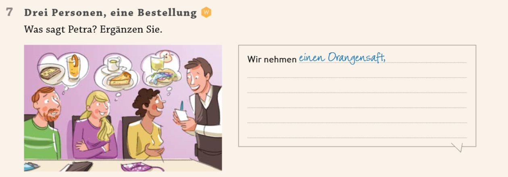
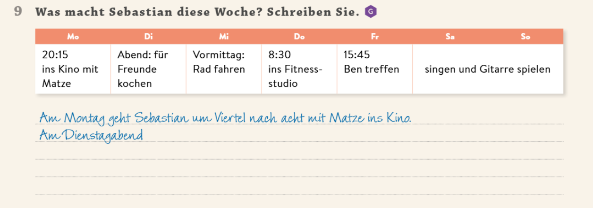

# Codigos Umlaut
ß	Alt + 0223  
ä	Alt + 0228  
Ä	Alt + 0196  
ö	Alt + 0246  
Ö	Alt + 0214  
ü	Alt + 0252  
Ü	Alt + 0220  

# Vokabular

Benutzen Sie die folgende Seite, um Vokabeln zu wiederholen:

https://learningapps.org/display?v=p6zt1eq6a20

# Aktivität 9 – Wiederholung mit Laura

**Vokabular**

1. mögen – gustar, agradar
2. möchten – querer, desear
3. nehmen – tomar (por ejemplo, en el restaurante)
4. Stück – pedazo, trozo
5. Kuchen – pastel, torta
6. Fleisch – carne

Diese Verben sind unregelmäßig. Beispiele für die Aktivität:

# Wir möchten zwei Joghurts und zwei Stück Schokoladenkuchen und ein Stuck Käse

1. Ich **nehme** Pizza und Spaghetti. – Yo tomo pizza y espaguetis.
2. Was **magst** du essen? – ¿Qué te gusta comer?
3. Wir möchten zwei Kaffee und ein Stück Kuchen. – Nosotros queremos dos cafés y un pedazo de pastel.
4. Anna **mag** keinen Fisch, aber sie **möchte** einen Salat. – A Anna no le gusta el pescado, pero quiere una ensalada.
5. **Mögt** ihr gern Schokolade? – ¿Os gusta el chocolate?
6. Ich **nehme** eine Suppe, bitte. – Yo tomo una sopa, por favor.
7. Mein Vater **mag** kein Gemüse. – A mi padre no le gustan las verduras.
8. **Möchtest** du einen Tee oder einen Saft? – ¿Quieres un té o un jugo?

# Konjugation von mögen und essen

ich mag – ich mag  
du magst – du magst  
er/es/sie mag – er/es/sie mag  

ich esse – ich esse  
du isst – du isst  
er/es/sie isst – er/es/sie isst  

# mögen – mögen, gefallen

## Beispiel 1

# Übung im Unterricht – Termin / Verabredung planen – Verabredung

* Möchtest du ins Kino gehen? – Möchtest du ins Kino gehen?
    Antwort: Ja, gern. // Ja, gute Idee.

* Hast du am Montag Zeit? – Hast du am Montag Zeit?
    Antwort: Wann denn? – Wann denn?
* Am Abend um 18:30 Uhr?
    Antwort: Nein, leider nicht.  
    Am Montagabend habe ich von 18:30 Uhr bis 20:45 Uhr Deutschkurs.  
    Vielleicht am Freitagabend?
* Nein, am Freitagabend gehe ich ins Fitnessstudio.  
    Und am Samstagmorgen?
    Antwort: Ja, am Samstagmorgen habe ich Zeit.
* Wunderbar! Dann bis Samstag!

# Übung 2 – Was isst du gern zum Frühstück?

**FRAGE: Was isst du gern zum Frühstück?** – ¿Qué te gusta comer en el desayuno?

* Mittagessen – Almuerzo
* Abendessen – Cena

**FRAGE 2: Was isst du oft zum Abendessen?** – ¿Qué sueles comer en la cena?

**FRAGE 3: Was magst du besonders gern essen?** – ¿Qué te gusta especialmente comer?

**FRAGE 4: Was magst du gar nicht essen?** – ¿Qué no te gusta nada comer?

**FRAGE 5: Was ist dein Lieblingsgetränk? / Lieblingsessen?** – ¿Cuál es tu bebida/comida favorita?

# Ejercicio 3- Mein Libilings...

# Ejercicio 4 - Terminen / Verabredung planen

 * Möchtest du ins Kino gehen?
 *  Ja, gern/ Ja, gute Idee.

 * Hast du am Montag Zeit?
 *  Wann denn?

 * Am Abend um 18:30 Uhr?
 *  Nein, leider nicht. Am Montagabend habe ich von 18:30 Uhr bis 20:45 Uhr Deutschkurs.

# Arbeitsbuch
 
## 11 - B

 1) Ich nehme einen Kaffe und _(einen)__ Kuchen
 2) Ich möchte __(ein)__ Brötchen mith Schinken
 3) Ich nehme __(eine)__ Suppe 
 4) Ich möchte einen Apfelsaft 

**Solucion ChatGPT**

 1) Ich nehme einen Kaffee und ein Stück Kuchen
 2) Ich möchte ein Brötchen mit Schinken. ✅

## 12 Im Café

a. Ordnen Sie zu und sortieren Sie den Dialog.
Palabras para usar:

* möchten

* tut mir leid

* wünschen

Diálogo con huecos:

1. Sie wünschen? 
2. möchten Sie einen Nusskuchen? 
3.  tut mir leid, aber wir haben keinen Schokoladenkuchen mehr.

Segundas frases del dialogo:

4. Schade. Dann nehme ich einen Apfelkuchen => 1
5. Ich nehme eine Tasse Tee und einen Kuchen, bitte.
6. Nein, danke! Einen Schokoladenkuchen, bitte.

Dialogo ordenado:

1 - 5 - 2 - 6 - 3 - 4 - 

## Examen - Ejercicio 7

Wir nehmen einen Orangensaft, einen Tee, einen Apfelsaft, ein Brot mit Käse, einen Nusskuchen und ein Fischbrötchen.

**Correcion ChatGPT**
Wir nehmen einen Tee, einen Apfelsaft, ein Brötchen mit Käse, ein Fischbrötchen und ein Stück Apfelkuchen.

## Examen - Ubong neun - Ejercicio 9

Am Montag geht Sebastian um Viertel nach acht mit Matze ins Kino. 

Am Dienstagabend Sebastian kocht für Freunde

Am Mittwoch um Vormittag Sebastian Rad fährst

Am Donnerstag um acht und dreißig Uhr Sebastian ins Fitness-Studio gehgst

Am Freitag am Viertel vor siebzehn Sebastian triffst Ben

Am Samstag und Sonntag Sebastian singen und Gitarre spielen

**Version ChatGPT**

1. Ok
2.  ✅ Am Dienstagabend kocht Sebastian für Freunde. (Verbo segunda posicion)
3.  ✅ Am Mittwochvormittag fährt Sebastian Rad.

    🔠“am Vormittag†→ mejor como una sola palabra: Mittwochvormittag
    ⌠“fährst†es para “duâ€; debe ser fährt (3. Person Singular)

4. ✅ Am Donnerstag geht Sebastian um halb neun ins Fitnessstudio.

    🔠“acht und dreißig Uhr†no es natural. En alemán se usa: halb neun (= 8:30)
    ⌠“gehgst†→ error, correcto es: geht
5. ✅ Am Freitag trifft Sebastian um Viertel vor vier Ben.

    🔠“siebzehn†= 17h = 5pm → Viertel vor fünf
    ⌠“triffst†→ error, correcto es: trifft

6. ✅ Am Samstag und Sonntag singt Sebastian und spielt Gitarre.

    🔠Usa verbo en 3. persona: singt / spielt